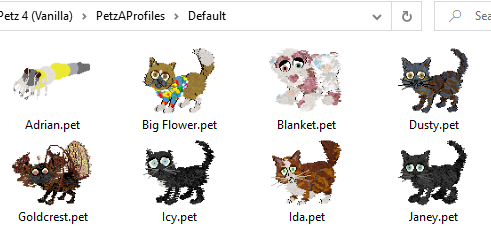

# Petz Thumbnails

View Petz 2-4 content with thumbnail images in Windows!

Shows images for .pet, .dog, .cat, .clo and .toy files.

## Installation

Download the installer from Releases. You don't need to install to your Petz directory.

If upgrading from a previous version, uninstall the previous version and restart your computer before running the new installer.

## Uninstall

Uninstall from Add/Remove programs.